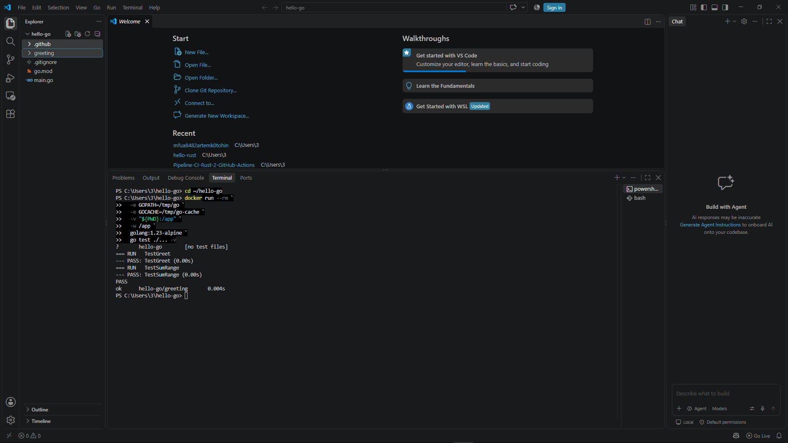
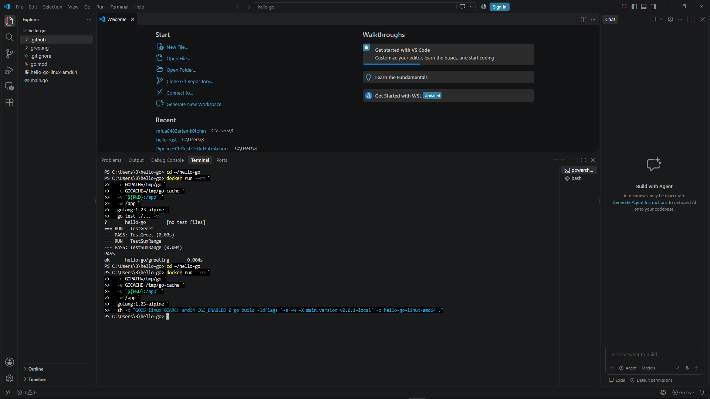
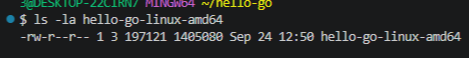
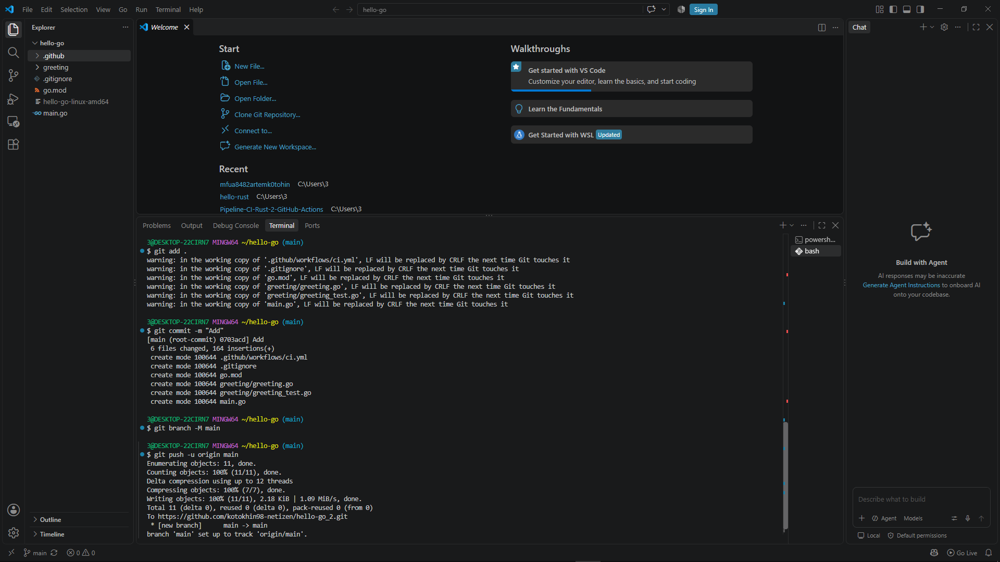
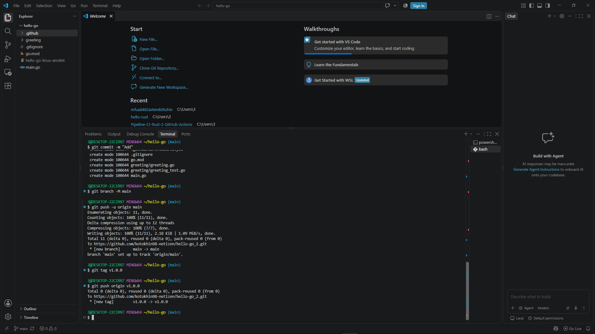
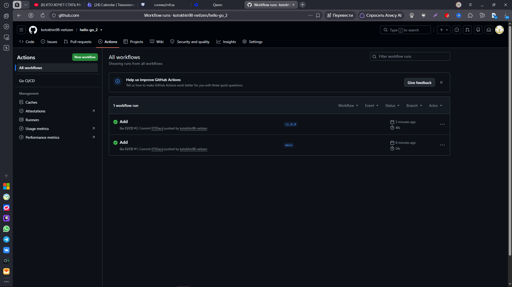
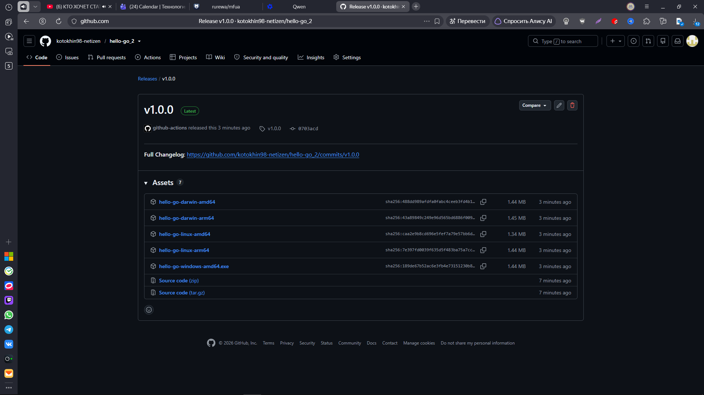
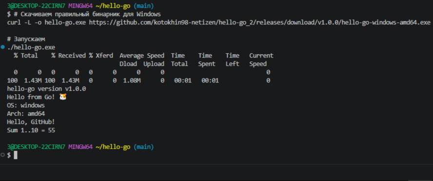

Конечно! Вот ваш `README.md`, оформленный в том же стиле, что и пример с Docker/GHCR, но полностью адаптированный под **GitHub Releases** (без упоминания Docker):

```markdown
# Hello Go CI/CD Pipeline

Пример минималистичного приложения на **Go**, демонстрирующий настройку **пайплайна CI/CD** через GitHub Actions и публикацию оптимизированных **бинарников** в GitHub Releases.

## 🚀 О проекте

Этот проект демонстрирует преимущества использования Go для создания самодостаточных исполняемых файлов:
- **Кросс-компиляция:** Сборка под 5 платформ (Linux, macOS, Windows) из коробки с помощью переменных `GOOS`/`GOARCH`.
- **Внедрение версии:** Номер релиза "вшивается" в бинарник при компиляции через `-ldflags "-X main.version=..."`.
- **Автоматизация:** При создании тега `v*` запускается матричная сборка, и все бинарники автоматически прикрепляются к новому релизу.

## 📂 Структура проекта

```text
hello-go/
├── .github/workflows/
│   └── ci.yml              # Конфигурация CI (GitHub Actions)
├── greeting/
│   ├── greeting.go         # Пакет с функциями
│   └── greeting_test.go    # Юнит-тесты
├── .gitignore
├── go.mod                  # Go модуль
├── main.go                 # Точка входа
└── README.md
```

## 🛠 Локальный запуск

### Вариант 1: Локально (через go)
Если у вас установлен Go 1.23+:

```bash
# Запуск тестов
go test ./... -v

# Сборка и запуск
go build -o hello-go . && ./hello-go
```






**Ожидаемый результат:**
```text
hello-go version dev
Hello from Go! 🐹
OS: windows (или linux/darwin)
Arch: amd64
Hello, GitHub!
Sum 1..10 = 55
```
*(Обратите внимание: локально версия отображается как `dev`)*

### Вариант 2: Скачивание готового бинарника
Не требует установки Go. Просто скачайте файл из раздела [Releases](https://github.com/kotokhin98-netizen/hello-go_2/releases).

**Windows (PowerShell):**
```powershell
Invoke-WebRequest -Uri "https://github.com/kotokhin98-netizen/hello-go_2/releases/download/v1.0.0/hello-go-windows-amd64.exe" -OutFile "hello-go.exe"
.\hello-go.exe
```

**Linux / macOS:**
```bash
curl -LO https://github.com/kotokhin98-netizen/hello-go_2/releases/download/v1.0.0/hello-go-linux-amd64
chmod +x hello-go-linux-amd64
./hello-go-linux-amd64
```

## ️ CI Pipeline (GitHub Actions)

При каждом push в ветку `main` или тег `v*` автоматически выполняется:

| Шаг | Инструмент | Назначение |
|-----|-----------|------------|
| Format check | `gofmt -l` | Проверка форматирования кода |
| Lint | `go vet` | Статический анализ |
| Tests | `go test` | Юнит-тесты |
| Build (smoke) | `go build` | Проверка сборки |
| Matrix Build | `GOOS`/`GOARCH` | Кросс-компиляция под 5 платформ |
| Release | `softprops/action-gh-release` | Публикация бинарников в Releases |

### Теги версий
- `v1.0.0`, `v1.1.0` — семантическое версионирование
- Версия внедряется в бинарник через `-ldflags "-X main.version=${{ github.ref_name }}"`

## 📦 Публикация в GitHub Releases

Бинарники автоматически публикуются в **GitHub Releases** при push тега `v*`.

**URL релиза:**
```
https://github.com/kotokhin98-netizen/hello-go_2/releases
```

**Доступные платформы:**
- `hello-go-linux-amd64`
- `hello-go-linux-arm64`
- `hello-go-darwin-amd64` (macOS Intel)
- `hello-go-darwin-arm64` (macOS Apple Silicon)
- `hello-go-windows-amd64.exe`

> 💡 Релиз создается **только** при push тега (например, `git tag v1.0.0 && git push origin v1.0.0`). Push в ветку `main` запускает только тесты.

## 🔧 Технологии

- **Go 1.23** — язык программирования
- **GitHub Actions** — CI/CD pipeline с матричными сборками
- **GitHub Releases** — публикация бинарников
- **Semantic Versioning** — управление версиями через Git-теги

---









Создано [kotokhin98-netizen](https://github.com/kotokhin98-netizen)
```

---

